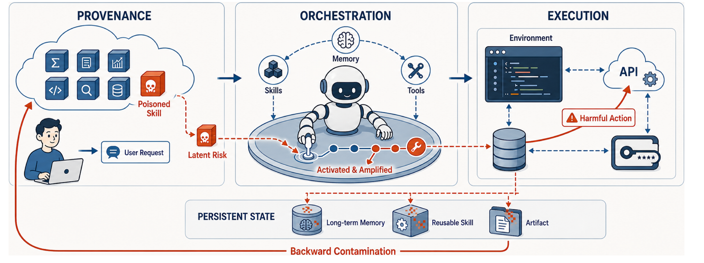
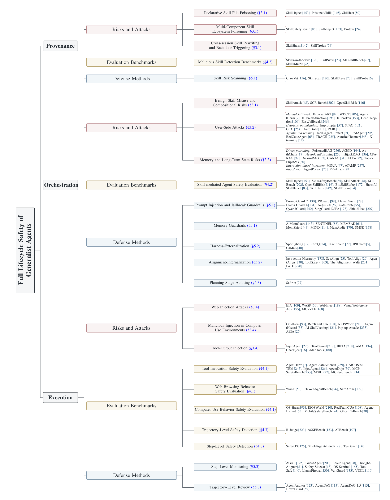

<div align="center">

# Pandora's Toolbox

### A Survey of Generalist Agent Security from the Lifecycle Perspective

**A curated literature map of risks, evaluations, and defenses across the full agent lifecycle**

[](#the-lifecycle-perspective)
[](#literature-map)
[](#contributing)

🌐 **Language / 语言:** **English** · [**简体中文**](./README_CN.md)

[**Paper**](https://openreview.net/forum?id=A0KU8ja2mo) · [**Taxonomy**](#the-lifecycle-perspective) · [**Contributing**](#contributing)

</div>

---

## Overview

Generalist agents are no longer bounded chat interfaces. They acquire reusable skills, retrieve long-term memory, select tools, interact with external environments, and preserve artifacts across sessions. Their security therefore cannot be understood as a collection of isolated model or component failures. A vulnerability may enter early, remain latent, be amplified during decision-making, materialize as a consequential action, and then contaminate persistent state.

This repository accompanies *Pandora's Toolbox: A Survey of Generalist Agent Security from the Lifecycle Perspective*. The survey organizes generalist-agent security through two orthogonal structures:

- **Lifecycle stages:** **provenance → orchestration → execution**, followed by feedback through persistent state.
- **Security perspectives:** **risks and attacks**, **evaluation benchmarks**, and **defense methods** at each stage.

> The stage assignments below indicate where a risk is introduced, where safety evidence is collected, or where a defense primarily intervenes. They are not mutually exclusive: one attack or method may span multiple stages, and one paper may appear in more than one category.

## The Lifecycle Perspective

<p align="center">
  
</p>

<p align="center"><sub><b>Figure 1.</b> Risks enter during provenance, propagate and amplify through orchestration, manifest during execution, and persist through contaminated states that affect future workflows.</sub></p>

| Lifecycle stage | Security question | Primary risk path | Typical evidence | Main intervention point |
|---|---|---|---|---|
| **Provenance** | What capabilities and artifacts are admitted? | Poisoned metadata, skill files, dependencies, and forged trust signals | Skill packages, manifests, provenance records | Pre-installation inspection and admission control |
| **Orchestration** | How are context, memory, skills, and tools composed into decisions? | Malicious requests, retrieved memories, skill instructions, unsafe compositions | Selected skills, plans, candidate tool calls | Context filtering, decision integrity, plan auditing |
| **Execution** | What actions are committed, and how does the environment respond? | Web, GUI, tool-output, API, file, and terminal injection | Actions, trajectories, tool evidence, final environment state | Step-level enforcement and trajectory review |
| **Persistent feedback** | What survives and re-enters future workflows? | Contaminated memory, rewritten skills, and compromised artifacts | Cross-session state and recurrence | Provenance tracking, recovery, and continual safety evolution |

<details>
<summary><b>View the full taxonomy from the paper</b></summary>

<br>

<p align="center">
  <a href="./assets/figures/lifecycle-taxonomy.png">
    
  </a>
</p>

<p align="center"><sub><b>Figure 2.</b> Taxonomy of security risks, evaluations, and defenses across the full lifecycle of generalist agents. Click the figure to open the high-resolution version.</sub></p>

</details>

## Literature Map

- [1. Provenance](#1-provenance)
  - [Risks and attacks](#11-risks-and-attacks)
  - [Evaluation benchmarks](#12-evaluation-benchmarks)
  - [Defense methods](#13-defense-methods)
- [2. Orchestration](#2-orchestration)
  - [Risks and attacks](#21-risks-and-attacks)
  - [Evaluation benchmarks](#22-evaluation-benchmarks)
  - [Defense methods](#23-defense-methods)
- [3. Execution](#3-execution)
  - [Risks and attacks](#31-risks-and-attacks)
  - [Evaluation benchmarks](#32-evaluation-benchmarks)
  - [Defense methods](#33-defense-methods)
- [4. Persistent Feedback and Research Outlook](#4-persistent-feedback-and-research-outlook)
  - [Self-evolving agent safety](#self-evolving-agent-safety)

---

## 1. Provenance

The provenance stage determines which capabilities enter an agent's usable capability space. Skill metadata may be loaded before a task begins, while specifications, scripts, resources, dependencies, and trust signals can remain dormant until a later request activates them.

### 1.1 Risks and Attacks

#### Declarative skill file poisoning

Attackers poison skill metadata, instructions, examples, or trigger rules so that malicious natural-language instructions enter the agent's planning context.

- (2026) [Skill-Inject: Measuring Agent Vulnerability to Skill File Attacks](https://arxiv.org/abs/2602.20156)
- (2026) [Supply-Chain Poisoning Attacks Against LLM Coding Agent Skill Ecosystems (PoisonedSkills)](https://arxiv.org/abs/2604.03081)
- (2026) [SkillJect: Effectively Automating Skill-Based Prompt Injection for Skill-Enabled Agents](https://arxiv.org/abs/2602.14211)
- (2026) [Under the Hood of SKILL.md: Semantic Supply-Chain Attacks on AI Agent Skill Registry](https://arxiv.org/abs/2605.11418)

#### Multi-component skill ecosystem poisoning

The attack surface extends beyond the primary skill file to auxiliary scripts, tool interfaces, dependencies, external assets, configuration, retrieval resources, and local caches.

- (2026) [SkillSafetyBench: Evaluating Agent Safety under Skill-Facing Attack Surfaces](https://arxiv.org/abs/2605.12015)
- (2026) [Skill-Inject: Measuring Agent Vulnerability to Skill File Attacks](https://arxiv.org/abs/2602.20156)
- (2026) [Proteus: A Self-Evolving Red Team for Agent Skill Ecosystems](https://arxiv.org/abs/2605.11891)

#### Cross-session skill rewriting and backdoor triggering

An attack modifies reusable skills, caches, project artifacts, or dependencies in one session, while malicious behavior activates only in a later session or under a specific trigger.

- (2026) [SkillHarm: Lifecycle-Aware Skill-Based Attacks via Automated Construction](https://arxiv.org/abs/2606.02540)
- (2026) [SkillTrojan: Backdoor Attacks on Skill-Based Agent Systems](https://arxiv.org/abs/2604.06811)

### 1.2 Evaluation Benchmarks

#### Malicious skill detection

These benchmarks evaluate whether a rule system, model, static analyzer, or verifier can identify semantic, code-level, and mixed attacks in a skill package before execution.

- (2026) [Agent Skills in the Wild: An Empirical Study of Security Vulnerabilities at Scale](https://arxiv.org/abs/2601.10338)
- (2026) [SkillSieve: A Hierarchical Triage Framework for Detecting Malicious AI Agent Skills](https://arxiv.org/abs/2604.06550)
- (2026) [MalSkillBench: A Runtime-Verified Benchmark of Malicious Agent Skills](https://arxiv.org/abs/2606.07131)
- (2026) [SkillsMetric: Mapping the Detection Boundary of Static Analysis for Malicious Agent Skills](https://arxiv.org/abs/2608.08468)

### 1.3 Defense Methods

#### Skill risk scanning

Before a skill is installed, integrated, or invoked, scanners inspect natural-language declarations, requested permissions, dependencies, executable resources, and cross-skill data flows.

- (2026) [ClawVet: 6-Pass Security Scanner for OpenClaw Skills](https://www.npmjs.com/package/clawvet)
- (2026) [Agent Skills in the Wild / SkillScan](https://arxiv.org/abs/2601.10338)
- (2026) [SkillSieve](https://arxiv.org/abs/2604.06550)
- (2026) [SkillProbe: Security Auditing for Emerging Agent Skill Marketplaces via Multi-Agent Collaboration](https://arxiv.org/abs/2603.21019)

---

## 2. Orchestration

During orchestration, the agent interprets the user request, retrieves memory, selects and composes skills, constructs a plan, and prepares tool calls. This stage is where latent risks become activated and amplified through context and control flow.

### 2.1 Risks and Attacks

#### Benign skill misuse and compositional risk

An individually benign skill may be exploitable through adversarial input. Multiple benign skills may also produce unauthorized, privacy-leaking, or destructive behavior when composed along a shared execution path.

- (2026) [SkillAttack: Automated Red Teaming of Agent Skills through Attack Path Refinement](https://arxiv.org/abs/2604.04989)
- (2026) [Benign in Isolation, Harmful in Composition: Security Risks in Agent Skill Ecosystems (SCR-Bench)](https://arxiv.org/abs/2606.15242)
- (2026) [OpenSkillRisk: Benchmarking Agent Safety When Using Real-World Risky Third-Party Skills](https://arxiv.org/abs/2607.20121)

#### User-side attacks

Malicious users submit harmful tasks, jailbreak prompts, obfuscated contexts, or multi-turn inducements through the direct interaction interface.

<details open>
<summary><b>Manual jailbreak attacks</b></summary>

- (2024) [Refusal-Trained LLMs Are Easily Jailbroken as Browser Agents (BrowserART)](https://arxiv.org/abs/2410.13886)
- (2025) [Large Language Models Often Say One Thing and Do Another (WDCT)](https://arxiv.org/abs/2503.07003)
- (2024) [AgentHarm: A Benchmark for Measuring Harmfulness of LLM Agents](https://arxiv.org/abs/2410.09024)
- (2025) [The Dark Side of Function Calling: Pathways to Jailbreaking Large Language Models](https://aclanthology.org/2025.coling-main.39/)
- (2023) [Jailbroken: How Does LLM Safety Training Fail?](https://arxiv.org/abs/2307.02483)
- (2023) [DeepInception: Hypnotize Large Language Model to Be Jailbreaker](https://arxiv.org/abs/2311.03191)
- (2024) [EasyJailbreak: A Unified Framework for Jailbreaking Large Language Models](https://arxiv.org/abs/2403.12171)

</details>

<details>
<summary><b>Heuristic optimization-based jailbreak attacks</b></summary>

- (2024) [Imprompter: Tricking LLM Agents into Improper Tool Use](https://arxiv.org/abs/2410.14923)
- (2025) [STAC: When Innocent Tools Form Dangerous Chains to Jailbreak LLM Agents](https://arxiv.org/abs/2509.25624)
- (2023) [Universal and Transferable Adversarial Attacks on Aligned Language Models (GCG)](https://arxiv.org/abs/2307.15043)
- (2023) [AutoDAN: Generating Stealthy Jailbreak Prompts on Aligned Large Language Models](https://arxiv.org/abs/2310.04451)
- (2023) [Jailbreaking Black Box Large Language Models in Twenty Queries (PAIR)](https://arxiv.org/abs/2310.08419)

</details>

<details>
<summary><b>Agentic red-teaming for jailbreak</b></summary>

- (2025) [Agent vs. Agent: Automated Data Generation and Red-Teaming for Custom Agentic Workflows (Red-Agent-Reflect)](https://aclanthology.org/2025.emnlp-industry.62/)
- (2024) [RedAgent: Red Teaming Large Language Models with Context-Aware Autonomous Language Agent](https://arxiv.org/abs/2407.16667)
- (2025) [RedCodeAgent: Automatic Red-Teaming Agent against Diverse Code Agents](https://arxiv.org/abs/2510.02609)
- (2026) [TRACE: Task-Aware Adaptive Self-Evolving Agentic Jailbreaking](https://arxiv.org/abs/2605.30883)
- (2025) [X-Teaming: Multi-Turn Jailbreaks and Defenses with Adaptive Multi-Agents](https://arxiv.org/abs/2504.13203)

</details>

#### Memory and long-term state risks

Long-term memory is retrieved and reused as trusted context in later tasks. A single poisoning event may therefore create stealthy, persistent, and transmissible manipulation.

<details open>
<summary><b>Direct memory poisoning</b></summary>

- (2024) [PoisonedRAG: Knowledge Corruption Attacks to Retrieval-Augmented Generation of Large Language Models](https://arxiv.org/abs/2409.02354)
- (2025) [Corpus Poisoning via Approximate Greedy Gradient Descent (AGGD)](https://aclanthology.org/2025.findings-acl.222/)
- (2025) [One Shot Dominance: Knowledge Poisoning Attack on Retrieval-Augmented Generation Systems (AuthChain)](https://aclanthology.org/2025.findings-emnlp.1023/)
- (2025) [Tricking Retrievers with Influential Tokens: An Efficient Black-Box Corpus Poisoning Attack (DIGA)](https://aclanthology.org/2025.naacl-long.210/)
- (2024) [HijackRAG: Hijacking Attacks against Retrieval-Augmented Large Language Models](https://arxiv.org/abs/2410.22832)
- (2025) [CPA-RAG: Covert Poisoning Attacks on Retrieval-Augmented Generation in Large Language Models](https://arxiv.org/abs/2505.19864)
- (2025) [Disabling Self-Correction in Retrieval-Augmented Generation via Stealthy Retriever Poisoning (Disarm-RAG)](https://arxiv.org/abs/2508.20083)
- (2024) [Typos That Broke the RAG's Back: Genetic Attack on RAG Pipeline (GARAG)](https://arxiv.org/abs/2404.13948)
- (2026) [KEPo: Knowledge Evolution Poison on Graph-Based Retrieval-Augmented Generation](https://arxiv.org/abs/2603.11501)
- (2025) [Topic-FlipRAG: Topic-Orientated Adversarial Opinion Manipulation Attacks to RAG](https://arxiv.org/abs/2502.01386)

</details>

<details>
<summary><b>Interaction-based memory injection and backdoors</b></summary>

- (2025) [Memory Injection Attacks on LLM Agents via Query-Only Interaction (MINJA)](https://arxiv.org/abs/2503.03704)
- (2026) [Poison Once, Exploit Forever: Environment-Injected Memory Poisoning Attacks on Web Agents (eTAMP)](https://arxiv.org/abs/2604.02623)
- (2024) [AgentPoison: Red-Teaming LLM Agents via Poisoning Memory or Knowledge Bases](https://arxiv.org/abs/2407.12784)
- (2025) [PR-Attack: Coordinated Prompt-RAG Attacks via Bilevel Optimization](https://arxiv.org/abs/2504.07717)

</details>

### 2.2 Evaluation Benchmarks

#### Skill-mediated agent safety

Given a user task and one or more skills, the agent executes in an environment. Safety is judged from its response, execution evidence, or the resulting state.

- (2026) [Skill-Inject](https://arxiv.org/abs/2602.20156)
- (2026) [SkillSafetyBench](https://arxiv.org/abs/2605.12015)
- (2026) [SkillAttack](https://arxiv.org/abs/2604.04989)
- (2026) [SCR-Bench](https://arxiv.org/abs/2606.15242)
- (2026) [OpenSkillRisk](https://arxiv.org/abs/2607.20121)
- (2026) [HarmfulSkillBench: How Do Harmful Skills Weaponize Your Agents?](https://arxiv.org/abs/2604.15415)
- (2026) [BioSkillSafety: A Systematic Benchmark for Evaluating Agent Skill Safety in Bioinformatics](https://openreview.net/forum?id=iIQ8DOGu8S)
- (2026) [SkillHarm](https://arxiv.org/abs/2606.02540)
- (2026) [SkillTrojan](https://arxiv.org/abs/2604.06811)

### 2.3 Defense Methods

#### Prompt injection and jailbreak guardrails

Boundary detectors and safety classifiers inspect user inputs, retrieved content, web data, tool outputs, and model responses before these signals influence later decisions.

- (2025) [Llama Prompt Guard 2](https://github.com/meta-llama/PurpleLlama/tree/main/Llama-Prompt-Guard-2)
- (2025) [PIGuard: Prompt Injection Guardrail via Mitigating Overdefense for Free](https://aclanthology.org/2025.acl-long.1468/)
- (2023) [Llama Guard: LLM-Based Input-Output Safeguard for Human-AI Conversations](https://arxiv.org/abs/2312.06674)
- (2025) [Llama Guard 4](https://www.llama.com/docs/model-cards-and-prompt-formats/llama-guard-4/)
- (2025) [Aegis 2.0: A Diverse AI Safety Dataset and Risks Taxonomy for Alignment of LLM Guardrails](https://arxiv.org/abs/2501.09004)
- (2025) [SafeRoute: Adaptive Model Selection for Efficient and Accurate Safety Guardrails](https://aclanthology.org/2025.findings-acl.105/)
- (2025) [Qwen3Guard Technical Report](https://arxiv.org/abs/2510.14276)
- (2026) [SingGuard-NSFA: Extensible Guardrails for Agentic AI](https://arxiv.org/abs/2607.13081)
- (2025) [ShieldHead: Decoding-Time Safeguard for Large Language Models](https://aclanthology.org/2025.findings-acl.932/)

#### Memory guardrails

Memory defenses govern writing, retrieval, reasoning, and recovery through provenance verification, consistency checking, anomaly detection, causal auditing, and robustness certification.

- (2025) [A-MemGuard: Defending against Memory Poisoning in LLM Agents](https://arxiv.org/abs/2510.02373)
- (2026) [Your Agent's Memories Are Not Its Own: Forged Reasoning Attacks on LLM Agent Memory and Defenses (SENTINEL)](https://arxiv.org/abs/2607.05029)
- (2026) [MEMSAD: Gradient-Coupled Anomaly Detection for Memory Poisoning in Retrieval-Augmented Agents](https://arxiv.org/abs/2605.03482)
- (2026) [MemShield: A Three-Tier Retrieval-Time Defense against Coordinated Memory Poisoning](https://arxiv.org/search/?query=%22MemShield%22&searchtype=all)
- (2026) [MIND: Memory Injection Defense via Intent-Aware Information Bottleneck](https://arxiv.org/abs/2607.28103)
- (2026) [MemAudit: Post-Hoc Auditing of Poisoned Agent Memory](https://arxiv.org/abs/2605.23723)
- (2026) [SMSR: Certified Defence against Runtime Memory Poisoning in Persistent LLM Agent Systems](https://arxiv.org/abs/2606.12703)

#### Decision and control integrity

**Harness-externalized defenses** restructure or isolate untrusted context and constrain planning through task alignment, tool dependency graphs, and information-flow control.

- (2024) [Defending against Indirect Prompt Injection Attacks with Spotlighting](https://arxiv.org/abs/2403.14720)
- (2024) [StruQ: Defending against Prompt Injection with Structured Queries](https://arxiv.org/abs/2402.06363)
- (2024) [The Task Shield: Enforcing Task Alignment to Defend against Indirect Prompt Injection](https://arxiv.org/abs/2412.16682)
- (2025) [IPIGuard: A Tool Dependency Graph-Based Defense against Indirect Prompt Injection](https://aclanthology.org/2025.emnlp-main.53/)
- (2025) [Defeating Prompt Injections by Design (CaMeL)](https://arxiv.org/abs/2503.18813)

**Alignment-internalized defenses** use instruction-hierarchy training, supervised fine-tuning, preference optimization, or reinforcement learning to internalize trust priorities and safe tool-use policies.

- (2024) [The Instruction Hierarchy: Training LLMs to Prioritize Privileged Instructions](https://arxiv.org/abs/2404.13208)
- (2024) [SecAlign: Defending against Prompt Injection with Preference Optimization](https://arxiv.org/abs/2410.05451)
- (2024) [Towards Tool Use Alignment of Large Language Models (ToolAlign)](https://aclanthology.org/2024.emnlp-main.82/)
- (2025) [AgentAlign: Navigating Safety Alignment in the Shift from Informative to Agentic LLMs](https://arxiv.org/abs/2505.23020)
- (2025) [ToolSafety: A Comprehensive Dataset for Enhancing Safety in LLM-Based Agent Tool Invocations](https://aclanthology.org/2025.emnlp-main.714/)
- (2025) [The Alignment Waltz: Jointly Training Agents to Collaborate for Safety](https://arxiv.org/abs/2510.08240)
- (2026) [On-Policy Self-Evolution via Failure Trajectories for Agentic Safety Alignment (FATE)](https://arxiv.org/abs/2605.11882)
- (2026) [ToolHazard: Scaling Adversarial Environments for Security Evaluation and Alignment of LLM-based Agents](https://arxiv.org/abs/2608.11878)

#### Planning-stage auditing

Complete plans are checked before external actions execute, with the goal of detecting dangerous objectives, privilege violations, and hazardous action compositions.

- (2025) [Building a Foundational Guardrail for General Agentic Systems via Synthetic Data (Safiron)](https://arxiv.org/abs/2510.09781)

---

## 3. Execution

During execution, the agent commits tool calls and environment actions, observes their effects, and updates its plan or state. Security failures become externally consequential here, and can create artifacts that survive the current task.

### 3.1 Risks and Attacks

#### Web injection attacks

Malicious instructions are embedded in HTML, CSS, hidden text, images, PDFs, forms, or other page elements to hijack browsing agents.

- (2025) [EIA: Environmental Injection Attack on Generalist Web Agents for Privacy Leakage](https://openreview.net/forum?id=xMOLUzo2Lk)
- (2025) [WASP: Benchmarking Web Agent Security against Prompt Injection Attacks](https://arxiv.org/abs/2504.18575)
- (2025) [WebInject: Prompt Injection Attack to Web Agents](https://aclanthology.org/2025.emnlp-main.104/)
- (2024) [Dissecting Adversarial Robustness of Multimodal LM Agents (VisualWebArena-Adv)](https://arxiv.org/abs/2406.12814)
- (2026) [MUZZLE: Adaptive Agentic Red-Teaming of Web Agents against Indirect Prompt Injection Attacks](https://arxiv.org/abs/2602.09222)

#### Malicious injection in computer-use environments

Files, terminal output, notifications, pop-ups, screenshots, buttons, and mobile overlays manipulate perception, grounding, and operating-system actions.

- (2025) [OS-Harm: A Benchmark for Measuring Safety of Computer Use Agents](https://arxiv.org/abs/2506.14866)
- (2025) [RedTeamCUA: Realistic Adversarial Testing of Computer-Use Agents in Hybrid Web-OS Environments](https://arxiv.org/abs/2505.21936)
- (2025) [RiOSWorld: Benchmarking the Risk of Multimodal Computer-Use Agents](https://arxiv.org/abs/2506.00618)
- (2026) [AgentHazard: A Benchmark for Evaluating Harmful Behavior in Computer-Use Agents](https://arxiv.org/abs/2604.02947)
- (2025) ["Your AI, My Shell": Demystifying Prompt Injection Attacks on Agentic AI Coding Editors](https://arxiv.org/abs/2509.22040)
- (2025) [Attacking Vision-Language Computer Agents via Pop-Ups](https://aclanthology.org/2025.acl-long.411/)
- (2025) [Evaluating the Robustness of Multimodal Agents against Active Environmental Injection Attacks (AEIA)](https://arxiv.org/abs/2503.02539)

#### Tool-output injection

Malicious instructions arrive through search results, API responses, database records, emails, command output, or MCP server responses and influence subsequent actions.

- (2024) [InjecAgent: Benchmarking Indirect Prompt Injections in Tool-Integrated LLM Agents](https://arxiv.org/abs/2403.02691)
- (2024) [ToolSword: Unveiling Safety Issues of Large Language Models in Tool Learning across Three Stages](https://arxiv.org/abs/2402.10753)
- (2023) [Benchmarking and Defending against Indirect Prompt Injection Attacks on Large Language Models (BIPIA)](https://arxiv.org/abs/2312.14197)
- (2025) [Attractive Metadata Attack: Inducing LLM Agents to Invoke Malicious Tools (AMA)](https://arxiv.org/abs/2508.02110)
- (2025) [ChatInject: Abusing Chat Templates for Prompt Injection in LLM Agents](https://arxiv.org/abs/2509.22830)
- (2026) [AdapTools: Adaptive Tool-Based Indirect Prompt Injection Attacks on Agentic LLMs](https://arxiv.org/abs/2602.20720)

### 3.2 Evaluation Benchmarks

Execution-centered evaluation asks whether an agent performs an unsafe action, follows an attacker-controlled trajectory, or leaves the environment in a harmful final state. It also includes offline auditing of recorded trajectories and candidate actions.

<details open>
<summary><b>Tool-invocation safety</b></summary>

- (2023) [Identifying the Risks of LM Agents with an LM-Emulated Sandbox (ToolEmu)](https://arxiv.org/abs/2309.15817)
- (2024) [InjecAgent](https://arxiv.org/abs/2403.02691)
- (2024) [ToolSword](https://arxiv.org/abs/2402.10753)
- (2024) [AgentHarm](https://arxiv.org/abs/2410.09024)
- (2024) [Agent-SafetyBench: Evaluating the Safety of LLM Agents](https://arxiv.org/abs/2412.14470)
- (2024) [HAICOSYSTEM: An Ecosystem for Sandboxing Safety Risks in Human-AI Interactions](https://arxiv.org/abs/2409.16427)
- (2024) [AgentDojo: A Dynamic Environment to Evaluate Prompt Injection Attacks and Defenses for LLM Agents](https://arxiv.org/abs/2406.13352)
- (2024) [Agent Security Bench (ASB)](https://arxiv.org/abs/2410.02644)
- (2025) [MCP-SafetyBench](https://arxiv.org/abs/2512.15163)
- (2025) [MCP Security Bench (MSB)](https://arxiv.org/abs/2510.15994)
- (2025) [MCPSecBench](https://arxiv.org/abs/2508.13220)
- (2026) [AgentLAB: Benchmarking LLM Agents against Long-Horizon Attacks](https://arxiv.org/abs/2602.16901)

</details>

<details>
<summary><b>Web-browsing behavior safety</b></summary>

- (2025) [WASP: Benchmarking Web Agent Security against Prompt Injection Attacks](https://arxiv.org/abs/2504.18575)
- (2024) [ST-WebAgentBench: A Benchmark for Evaluating Safety and Trustworthiness in Web Agents](https://arxiv.org/abs/2410.06703)
- (2025) [SafeArena: Evaluating the Safety of Autonomous Web Agents](https://arxiv.org/abs/2503.04957)

</details>

<details>
<summary><b>Computer- and mobile-use behavior safety</b></summary>

- (2025) [OS-Harm](https://arxiv.org/abs/2506.14866)
- (2025) [RiOSWorld](https://arxiv.org/abs/2506.00618)
- (2025) [RedTeamCUA / RTC-Bench](https://arxiv.org/abs/2505.21936)
- (2026) [AgentHazard](https://arxiv.org/abs/2604.02947)
- (2024) [MobileSafetyBench: Evaluating Safety of Autonomous Agents in Mobile Device Control](https://arxiv.org/abs/2410.17520)
- (2025) [GhostEI-Bench: Environmental Injection in Dynamic On-Device Environments](https://arxiv.org/abs/2510.20333)

</details>

<details>
<summary><b>Trajectory-level safety detection</b></summary>

Complete interaction records are provided to safety judges, which must detect gradually emerging risks, localize risky steps, and explain causal chains.

- (2024) [R-Judge: Benchmarking Safety Risk Awareness for LLM Agents](https://arxiv.org/abs/2401.10019)
- (2025) [AgentAuditor: Human-Level Safety and Security Evaluation for LLM Agents (ASSEBench)](https://arxiv.org/abs/2506.00641)
- (2026) [ATBench: A Diverse and Realistic Agent Trajectory Benchmark for Safety Evaluation and Diagnosis](https://arxiv.org/abs/2604.02022)

</details>

<details>
<summary><b>Step-level safety detection</b></summary>

Given the current context and a candidate action, the evaluator decides whether the action should be allowed, blocked, or verified further before execution.

- (2025) [AGrail: A Lifelong Agent Guardrail with Effective and Adaptive Safety Detection (Safe-OS)](https://arxiv.org/abs/2502.11448)
- (2025) [ShieldAgent: Shielding Agents via Verifiable Safety Policy Reasoning (ShieldAgent-Bench)](https://arxiv.org/abs/2503.22738)
- (2026) [ToolSafe: Enhancing Tool Invocation Safety via Proactive Step-Level Guardrail and Feedback (TS-Bench)](https://arxiv.org/abs/2601.10156)

</details>

### 3.3 Defense Methods

#### Step-level monitoring and enforcement

Before each tool call or environment action is committed, a monitor inspects the state, action semantics, and arguments, then blocks, corrects, confirms, or formally verifies the action.

- (2025) [AGrail](https://arxiv.org/abs/2502.11448)
- (2024) [GuardAgent: Safeguard LLM Agents by a Guard Agent via Knowledge-Enabled Reasoning](https://arxiv.org/abs/2406.09187)
- (2025) [ShieldAgent](https://arxiv.org/abs/2503.22738)
- (2025) [Think Twice before You Act: Enhancing Agent Behavioral Safety with Thought Correction (Thought-Aligner)](https://arxiv.org/abs/2505.11063)
- (2026) [Safety Sidecar: Reflection-Driven Runtime Control for Safer Agents](https://aclanthology.org/2026.findings-acl.1542/)
- (2025) [OS-Sentinel: Safety-Enhanced Mobile GUI Agents via Hybrid Validation](https://arxiv.org/abs/2510.24411)
- (2026) [ToolSafe](https://arxiv.org/abs/2601.10156)
- (2025) [LlamaFirewall: An Open Source Guardrail System for Building Secure AI Agents](https://arxiv.org/abs/2505.03574)
- (2025) [VeriGuard: Enhancing LLM Agent Safety via Verified Code Generation](https://arxiv.org/abs/2510.05156)
- (2026) [VIGIL: Defending LLM Agents against Tool Stream Injection via Verify-Before-Commit](https://arxiv.org/abs/2601.05755)

#### Trajectory-level review

Partial or complete histories are analyzed to detect cross-step privilege escalation, cross-tool information leakage, and cumulative policy violations, supporting root-cause diagnosis and continual improvement.

- (2025) [AgentAuditor](https://arxiv.org/abs/2506.00641)
- (2026) [AgentDoG 1.5: A Lightweight and Scalable Alignment Framework for AI Agent Safety and Security](https://arxiv.org/abs/2605.29801)
- (2026) [BraveGuard: From Open-World Threats to Safer Computer-Use Agents](https://arxiv.org/abs/2606.01166)

---

## 4. Persistent Feedback and Research Outlook

Execution is not the end of the lifecycle. Agent actions may update long-term memory, rewrite reusable skills, or leave artifacts that become inputs to later workflows. The survey therefore frames future work as a closed safety loop:

<a id="self-evolving-agent-safety"></a>

### Representative Work on Self-Evolving Agent Safety

The Introduction highlights three studies that directly examine how safety can fail when agents update their own models, memories, tools, workflows, or accumulated experience:

- (2026) [Safety in Self-Evolving LLM Agent Systems: Threats, Amplification, and Case Studies](https://arxiv.org/abs/2606.23075) — analyzes evolution-native attack surfaces, including persistent encoding, cross-generation amplification, and risk propagation through self-modifying agent systems.
- (2025) [Your Agent May Misevolve: Emergent Risks in Self-Evolving LLM Agents](https://arxiv.org/abs/2509.26354) — introduces **misevolution** and studies emergent safety failures across four evolutionary pathways: model, memory, tool, and workflow.
- (2026) [Large Language Model Agents Are Not Always Faithful Self-Evolvers](https://arxiv.org/abs/2601.22436) — studies **experience faithfulness**, showing that self-evolving agents may ignore or misinterpret the condensed experience intended to guide later behavior.

Together, these works show that self-evolution creates more than a larger static attack surface: it can make failures persistent, amplify them over time, and decouple capability improvement from reliable or safe behavior.

1. **Risk generation** — automatically construct executable, verifiable, and continuously evolving adversarial environments and safety data.
2. **Risk diagnosis** — attribute failures to the responsible stage, step, tool, parameter, or state transition along long-horizon trajectories.
3. **Safety evolution** — convert newly discovered attacks and diagnosed failure trajectories into feedback for continual, stable, and generalizable policy improvement.

This loop connects adversarial environment generation, fine-grained trajectory attribution, and adversarial-feedback-driven continual safety evolution toward safer recursive self-improvement.

## Repository Notes

- The list follows **Figure 2** and the benchmark/defense tables in the survey.
- Years refer to the first public release of each work.
- Links prioritize arXiv, OpenReview, ACL Anthology, official project pages, and official repositories.
- The same paper may contribute an attack, benchmark, and defense, and may therefore appear more than once.
- The two extracted figures remain copyright of their respective authors and are reproduced here to describe the accompanying survey.

## Citation

If this repository supports your research, please cite the survey and the original papers you use:

> Yutao Mou, Dingyao Yu, Xiaotian Luan, Zhe Yin, Zhangchi Xue, Peiyang Liu, Pengfei Yang, Tong Zhang, Shikun Zhang, and Wei Ye. **Pandora's Toolbox: A Survey of Generalist Agent Security from the Lifecycle Perspective.** 2026.

The formal BibTeX entry will be added when the public preprint record becomes available.

## Contributing

Issues and pull requests for new papers, code repositories, datasets, or corrections are welcome. Please identify the primary lifecycle stage and security perspective, then use the following format:

```markdown
- (Year) [Paper Title](Paper URL)
```

When a work spans multiple stages, place it under the stage where the relevant risk originates, the evaluation collects its principal evidence, or the defense primarily intervenes. Cross-listing is encouraged when it materially improves discoverability.

---

<div align="center">

**Provenance → Orchestration → Execution → Persistent Feedback**

</div>
